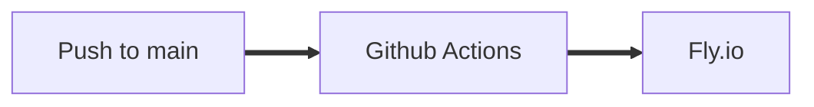

# Bordtennis Nexus Service

## Motivation

This service adresses the need to connect players together. If two players each go to
https://bordtennis.oslo.systems/epicmatch, their scoreboards will be linked. Any updates will propagate to both scoreboards.

This can enable IOT devices to manipulate the scoreboards, or to present a scoreboard on a screen for more to see.

## Usage

Use `make run` to start the server locally. The server will be available at http://localhost:3000.

## Stack

- [Golang](https://golang.org/)
- [Gorilla Websocket](https://github.com/gorilla/websocket)
- [Fly.io](https://fly.io/)

## Contribute

See [CONTRIBUTING.md](./CONTRIBUTING.md)

## Production pipeline

